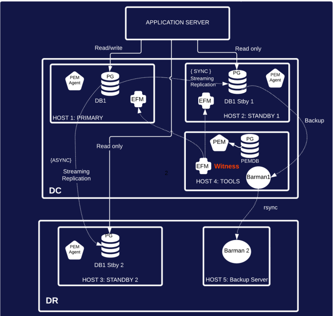
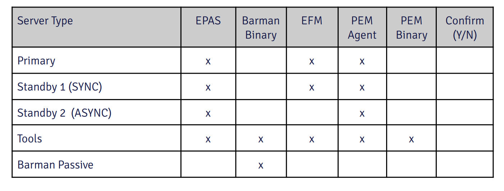

# PostgreSQL_EDB With HA Cluster 

- Chosen Architecture


#### Lab Setup Requrement 
- VM with RHEL 8 minimum 2 GB RAM 20 GB Free space 
- EDB credentials for EDB Repos 2.0
- Internet access 

#### Prerequisite
- RHEL 8 subscribe with Redhat 
- Ensure that all servers can use ssh/scp passwordless communication
- Proʀde SSH access
- Proʀde SUDO priʀleges
- Adjust firewall to allow EFM agents to communicate on ports 7800 and 7810
- Adjust firewall to allow communication on designated database port between Database
- servers, EFM, and PEM server: typically port 5444
- Access to ping 8.8.8.8 or another internal server that should always answer
- Reserve an IP address on the same subnet as all servers for the VIP (Virtual IP Address)

- The following components will be installed on each of the servers



## RHEL Subscribe

-   Create RHN id / RedHat account in [redhat](https://www.redhat.com/)
-   Register System with redhat
-   Attach pool for ansible
-   Enable repos for ansible
-   dnf install ansible -y

## Subscribe your system with Redhat
```sh
subscription-manager register
subscription-manager list --available
subscription-manager attach --pool=<pool id>
subscription-manager repos --enable ansible-VERSION-for-rhel-8-x86_64-rpms
subscription-manager repos --enable ansible-2.9-for-rhel-8-x86_64-rpms
yum install bash-completion
```

#### Installation Step with details 
- Step 1: [Install EPAS](https://github.com/oralinnet/PostgreSQL_EDB/blob/main/Install/Install_EPAS.md)
- Step 2: [Configure Replica](https://github.com/oralinnet/PostgreSQL_EDB/blob/main/Install/EPAS_Replica.md)
- Step 3: [Install EFM](https://github.com/oralinnet/PostgreSQL_EDB/blob/main/Install/EFM_Install.md)
- Step 4: [Install Pgbouncer](https://github.com/oralinnet/PostgreSQL_EDB/blob/main/Install/EDB_Pgbouncer_Install.md)
- Step 5: [Install Barman](https://github.com/oralinnet/PostgreSQL_EDB/blob/main/Install/Barman_install.md)
